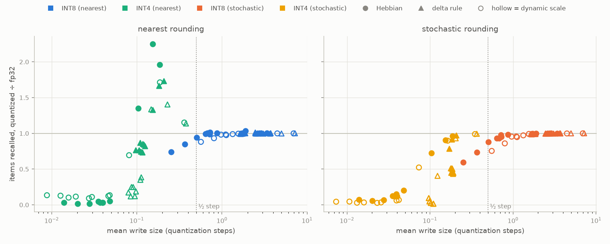

# coral-hebbian

**Can a brain-style memory keep learning when it's stored in 8-bit or 4-bit integers?**

NPUs like the Coral NPU on Google's Coralboard (Synaptics Astra SL2619, 1 TOPS) are inference-only: weights are fixed when the model is compiled. A *fast-weight* memory doesn't need weight updates, though. It learns by updating a state matrix on every step, Hebbian style ("neurons that fire together wire together"):

```
S <- λ·S + β·v·kᵀ            Hebbian: strengthen the key→value association, let old ones decay
S <- λ·S + β·(v - λ·S·k)·kᵀ  delta rule: write only the error, which overwrites the old value
```

To the NPU, that's just a tensor carried from one step to the next, so the chip can do it. The catch is that the chip stores that tensor as low-precision integers. This repo asks what happens to the memory when S is rounded to INT8 or INT4 after every write.

> **Status:** simulation phase (PyTorch, fake quantization). Validation on the actual board is next. Findings are **preliminary**: 3–10 seeds, one memory size (d = 128), synthetic tasks.



## Findings so far

**1. What matters is how big one write is compared to one quantization step.** With a static scale and plain rounding, every configuration whose writes are at least about 0.6–0.7 of a step matches full precision (0.99–1.03×, the filled points on the right of the plot above). That covers both update rules and every decay rate we tried. At about 0.5 steps and below, every configuration deviates. A dynamic scale adds damage of its own even above the threshold (INT8: 0.93–0.98× at 0.8–1.1 steps).

**2. INT8 is fine as long as the memory decays.** With no decay (λ = 1), the state keeps growing, so writes shrink relative to the fixed INT8 step. We predicted INT8 would start failing after about 1–2k writes, and it did:

| writes stored | write size (steps) | recall vs fp32 |
|---|---|---|
| 512 | 0.71 | 0.99 |
| 1024 | 0.51 | 0.94 |
| 2048 | 0.37 | 0.85 |
| 4096 | 0.25 | 0.74 |

With even slight decay (λ = 0.999), writes stay above about 0.64 steps and INT8 with plain rounding holds (0.99–1.01×) at every length we tested.

**3. INT4 breaks, and λ decides how.** Rounding creates a dead zone: `round(λ·s) == s` whenever `(1-λ)·|s| < 0.5`, so small entries never decay. With short λ, that makes memories last *longer* than fp32 (Hebbian λ = 0.97: 152 items recalled vs 67). With long λ, writes round to zero and the memory stops learning (λ = 1: 14 vs 480). With a per-step (dynamic) scale, it keeps its *first* writes and ignores new ones, which gives an inverted forgetting curve.

**4. The "longer memory" is a bug: stuck decay makes Hebbian memory answer from the past.** In a rebinding task (the same keys get new values over time), INT4 Hebbian gives stale answers. The delta rule doesn't, because it forgets on purpose by subtracting the old value, not by decaying:

| λ = 0.99, % current / % stale | fp32 | INT4, static scale | INT4, dynamic scale |
|---|---|---|---|
| Hebbian | 80 / 12 | 15 / 57 | 1 / 79 |
| delta rule | 86 / 1 | 94 / 1 | 86 / 4 |

**5. The obvious fixes don't help.** Stochastic rounding is unbiased on average, but its noise costs more than the bias it removes (INT8, 4096 writes: 0.60 of fp32 vs 0.74 for plain rounding). A dynamic scale re-rounds every entry on every step and adds damage of its own.

**What to run on the chip:** delta rule, INT8 (INT4 if you have to), and one static scale for the whole state tensor.

Details, numbers, and caveats: [`results/phase1-notes.md`](results/phase1-notes.md) (recall sweep, 10 seeds), [`results/writesize/notes.md`](results/writesize/notes.md) (write-size test), [`results/rebind/notes.md`](results/rebind/notes.md) (rebinding).

## How the experiments work

- **Recall:** stream T random key→value pairs into the memory, then query every key and decode against a codebook of 256 values. Accuracy by *age* (writes since a pair was stored) gives the whole forgetting curve in one run.
- **Rebinding:** 64 keys each get a new value about 16 times over 1024 writes. The right answer is a key's latest value. Decoding an older one counts as stale.
- **Quantization:** after every write, S is snapped to a symmetric integer grid (saturating), and the math inside a step stays float. The grid is **static** (calibrated on a held-out float run, the way a compiled model would be) or **dynamic** (rescaled every step). Rounding is **nearest** or **stochastic**.
- Every config sees the identical stream for a given seed, so comparisons are paired.

## Reproduce

```bash
python -m venv .venv
.venv/Scripts/python -m pip install torch --index-url https://download.pytorch.org/whl/cpu   # Windows paths; use .venv/bin on macOS/Linux
.venv/Scripts/python -m pip install -r requirements.txt
.venv/Scripts/python -m pytest -q

# recall sweep (about 1 min per seed on a laptop CPU)
.venv/Scripts/python experiments/sweep.py --seeds 10 --out results/multiseed
# write-size test
.venv/Scripts/python experiments/sweep.py --seeds 3 --out results/writesize/T512
.venv/Scripts/python experiments/sweep.py --seeds 3 --T 4096 --lams 0.999 1.0 --out results/writesize/T4096
.venv/Scripts/python experiments/collapse.py results/writesize/*/summary.csv
# rebinding
.venv/Scripts/python experiments/rebind_sweep.py --seeds 3
```

Add `--quick` to any sweep for a few-second smoke test.

## Layout

```
fastweight/quant.py        fake quantization (nearest / stochastic, saturating)
fastweight/memory.py       update rules + quantized state carrier, write-size tracking
fastweight/recall.py       recall task, calibration
fastweight/rebind.py       rebinding task
experiments/sweep.py       recall grid: CSVs + forgetting-curve plots
experiments/collapse.py    quantized/fp32 against write size
experiments/rebind_sweep.py
tests/                     dead zone, stochastic unbiasedness, exact recall, delta overwrite, rebind scoring
results/                   CSVs, plots, and notes for every run above
```

## Next

1. **On the board:** export the update step `(k, v, S) -> (readout, S')` as a static graph, compile it with Synaptics' Torq compiler, and check that the NPU matches the simulation. Rounding, saturation, and requantization differences are findings too.
2. **Demo:** a camera few-shot learner. Show the Coralboard a new object a few times and it recognizes it afterward, learning with no backprop.

## License

MIT, see [LICENSE](LICENSE).
